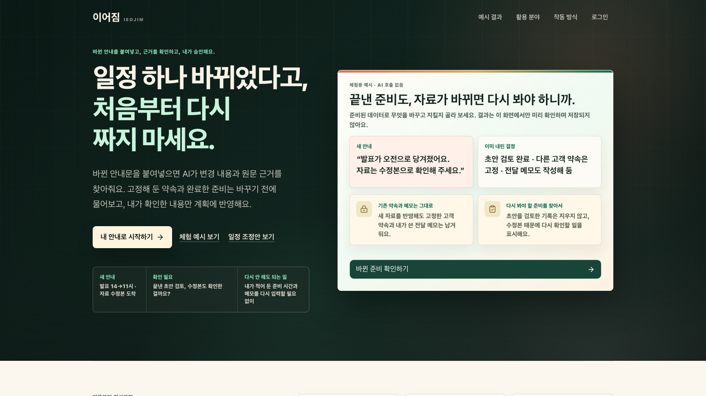
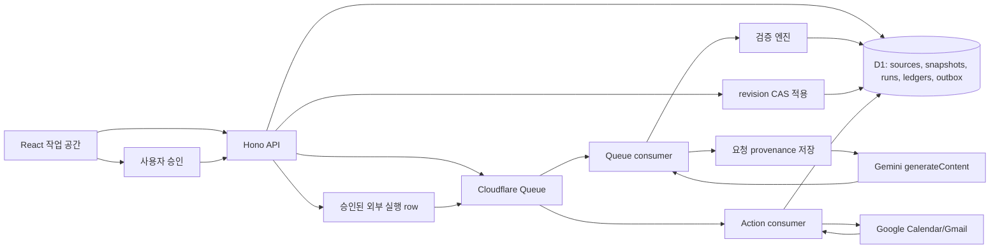

# 이어짐 · IEOJIM

자료가 바뀌어도 사용자가 직접 고친 내용과 확정한 결정을 잃지 않도록 돕는 변경 검토 작업 공간입니다. Gemini는 원문에서 변경 후보와 근거를 제안하고, TypeScript 검증 코드는 근거 위치, 숫자, 날짜·시간, 기준 버전, 보호 상태를 확인합니다. 사용자가 승인한 묶음만 D1에 원자적으로 저장합니다.



**원문을 검증 가능한 상태로 바꾸는 운영 데이터 파이프라인**을 구현한 프로젝트입니다. Data Engineer 관점에서는 데이터 계약·추적성·멱등성·장애 복구를, AI/AX Engineer 관점에서는 모델 출력 검증과 승인된 업무 실행을 설명할 수 있습니다.

- 서비스: https://ieojim.jungseongheon.org
- 바로가기: https://jungseongheon.org/ieojim
- 기술: TypeScript, React/Vite, Hono, Cloudflare Workers, D1, Queues, Google OAuth/Calendar, Gemini generateContent
- 상세 포트폴리오 문서: [엔지니어링 케이스 스터디](docs/portfolio/engineering-case-study.md)
- 구현 상태와 검증 기록: [PLANS.md](PLANS.md)
- 브랜치 운영과 보호 상태: [브랜치 운영](docs/operations/branch-workflow.md)

## 문제

일정, 과제, 고객 미팅 안내처럼 원문이 계속 바뀌는 작업에서는 "새 안내가 왔다"는 이유만으로 전체 계획을 다시 생성하면 위험합니다.

- 사용자가 직접 고친 문장, 완료 체크, 고정한 약속이 사라질 수 있습니다.
- 새 원문과 기존 결정이 충돌하는데 자동으로 덮어쓸 수 있습니다.
- 모델이 그럴듯한 값을 만들었어도 숫자, 날짜, 근거 위치가 원문과 다를 수 있습니다.
- Queue 중복 전달, 외부 API 시간 초과, 응답 유실, 오래된 브라우저 탭에도 대비해야 합니다.

이어짐은 원문 근거를 추적하고 변경을 검토하는 파이프라인으로 이 문제를 다룹니다.

## 실제 동작

구현된 검증 규칙을 하나로 묶어 설명한 합성 예시입니다. 기존 계획에는 4명이 900,000원을 나눠 225,000원씩 부담하고, 첫날 10:00에 도착하며, 둘째 날 19:00 저녁 약속은 사용자가 고정했고, 종이 확인서 출력 항목은 완료된 상태로 저장되어 있습니다.

새 안내:

> 참석자는 3명으로 변경됩니다. 첫날 도착은 오전 10시가 아니라 오후 4시입니다. 둘째 날 저녁 약속은 오후 8시로 변경해야 합니다. 종이 확인서 출력 항목은 삭제해 주세요.

서비스는 이 문장을 새 source revision으로 저장합니다. 모델 제안을 바로 반영하지 않고, 검증 코드가 900,000 / 3 = 300,000 계산, 도착 시간 근거, 잠긴 저녁 약속과의 충돌, 완료 항목 삭제 요청을 확인합니다. 사용자는 충돌을 직접 선택하고, 승인한 결과만 저장됩니다. 각 규칙은 아래 테스트와 검증 기록에서 확인할 수 있습니다. 이 설명 예시로 일반 모델 정확도를 판단하지 않습니다.

## 구조



## 엔지니어링 포인트

- **원문과 근거 추적**: 원문에는 관계·해시·버전을, 추출한 사실에는 근거 문장의 위치를 저장합니다. 원문, 파생 값, 수동 편집을 구분합니다.
- **중복 처리 방지**: Queue의 at-least-once 전달을 전제로 D1에서 실행 권한을 먼저 획득합니다. 중복 메시지는 추가 유료 호출 없이 건너뜁니다.
- **데이터 품질 검증**: Zod 스키마와 검증 함수로 출력 형식, 원문 인용, 금액·수량·날짜의 의미와 계산 가능 범위를 확인합니다.
- **승인과 원자적 적용**: 내용·원문 버전이 제안의 기준과 일치할 때만 승인한 변경을 적용합니다. 오래된 제안은 거절합니다.
- **사용자 상태 보존**: 직접 수정한 내용, 고정한 결정, 완료 기록, 재확인 여부를 명시적으로 관리합니다.
- **이력과 복원**: 복원도 새 내용 버전을 만듭니다. 인증·비용 장부·원문 목록·만료 시각은 복원 대상에서 제외합니다.
- **비용과 불확실성 제어**: 모델 호출 예산을 먼저 예약하고 실제 사용량을 기록합니다. 예약액은 공급자 청구의 강제 상한은 아닙니다. 결과를 알 수 없는 유료 호출은 자동 재시도하지 않습니다.
- **승인된 업무 실행**: Calendar·메일 실행 요청을 별도 outbox에 저장합니다. Calendar는 권한·일정 충돌·고정 이벤트 ID·etag를 확인하고, 반영 후 재조회합니다. 실제 검증 범위는 아래에 구분했습니다.
- **승인 이후 상태 확인**: 9월 19일 로컬 후보에서는 실행 이력과 이후 Calendar 관찰을 분리했습니다. 사용자 동의로 최대 24시간 읽기 전용 확인을 예약하고, 외부 변경·기준 변경·연결 해제를 만나면 멈춥니다. 중복 cron과 늦은 응답은 DB claim과 조건부 갱신으로 제어합니다. [설계](docs/design/change-assurance-2026-09-19.md) · [운영과 수동 확인](docs/operations/calendar-verification-2026-09-19.md)

## 검증 근거

최신 검증 근거는 [PLANS.md](PLANS.md)에 있습니다. 2026-09-16 기준 최신 문서화 배포 버전은 `938bbda4-c3b4-4b43-81a4-b60ad54995ab`입니다. 위 이미지는 2026-09-16 제품 개선 당시 캡처입니다. 이후 날짜 입력 개선의 배포 버전과는 구분합니다.

- `npm run verify`는 2026-09-16 검증에서 typecheck, lint, unit/integration, build를 통과했습니다.
- 날짜 입력 관련 집중 검사는 단위 테스트 50개와 D1 통합 테스트 1개를 통과했습니다.
- 전체 Chromium E2E는 2026-09-16 검증에서 111/111을 통과했습니다.
- 날짜 입력 개선 기록: [docs/validation/evidence-date-input-2026-09-16.md](docs/validation/evidence-date-input-2026-09-16.md)
- 합성 전략 비교: [docs/evaluations/finals-paired-2026-09-12.md](docs/evaluations/finals-paired-2026-09-12.md). 실제 사용자 생산성이나 경쟁 제품 우위 주장이 아닙니다.
- GitHub push 뒤 재현 가능한 CI 결과는 [verify workflow](https://github.com/masondev1024/ieojim/actions/workflows/verify.yml)에서 확인합니다.

키 설정, 로컬 DB, 원본 실행 로그와 에이전트 상태는 Git에 포함하지 않습니다. 문서에서 참조하는 `.omx/`·`artifacts/` 기록은 운영자의 로컬 작업 공간에 남으며, 저장소에는 검증 요약을 보관합니다.

## 로컬 실행

Node.js 24 이상이 필요합니다.

```sh
git clone https://github.com/masondev1024/ieojim.git
cd ieojim
npm ci
npm run build
npm run db:local
npm run dev
```

Vite 앱은 `http://127.0.0.1:5173`, 로컬 Worker는 `http://127.0.0.1:8787`에서 실행됩니다. 로컬 D1은 `.wrangler/` 아래에 저장됩니다.

실제 AI 처리는 `.dev.vars.example`을 `.dev.vars`로 복사하고 `GEMINI_API_KEY`를 로컬에 설정해야 합니다. 키가 없으면 원문 저장은 가능하지만 실제 모델 호출은 사용할 수 없습니다. 키는 커밋하지 않습니다.

## 검증

```sh
npm run verify
npx playwright install chromium
npm run test:e2e
npm run eval:live -- --dry-run
npm run cf:readiness
npm run release:prepare
```

`npm run verify`는 타입 검사·린트·단위 및 Workers/D1 통합 테스트·빌드를 실행합니다. E2E는 별도 포트와 임시 D1을 씁니다. `eval:live -- --dry-run`은 유료 모델 호출 없이 평가 계획만 확인합니다. CI는 이 검증과 모델 평가·배포의 dry-run만 실행합니다. 실제 배포나 유료 모델 호출은 별도 작업입니다.

## 한계

- Spark, Airflow, Kafka, dbt, Iceberg 기반 분석 플랫폼은 아닙니다. 이 프로젝트의 DE 가치는 운영 데이터 정합성과 복구 가능성에 있습니다.
- Calendar는 한 번의 실제 승인 실행에서 합성 일정 4건을 반영·재조회했습니다. 9월 16일에는 전체 Google 연동 검증을 다시 수행하지 않았으며, 실제 메일 발송은 미검증입니다.
- 9월 19일 재확인 기능은 로컬 구현·검증 범위입니다. 실제 Google 자동 확인과 원격 배포는 별도 인수 작업입니다. 예약은 15분 간격이며 처리량에 따라 지연될 수 있습니다.
- 자연어 날짜를 구조화하는 능력은 완전하지 않습니다. 확인 가능한 날짜 정보가 없으면 원문 근거를 보존하고 사용자가 확인해야 합니다.
- 장기 보관 정책, 계정 전체 삭제, 유료 요금제, 외부 알림 연결, 장기간 운영 관찰은 후속 작업입니다.
