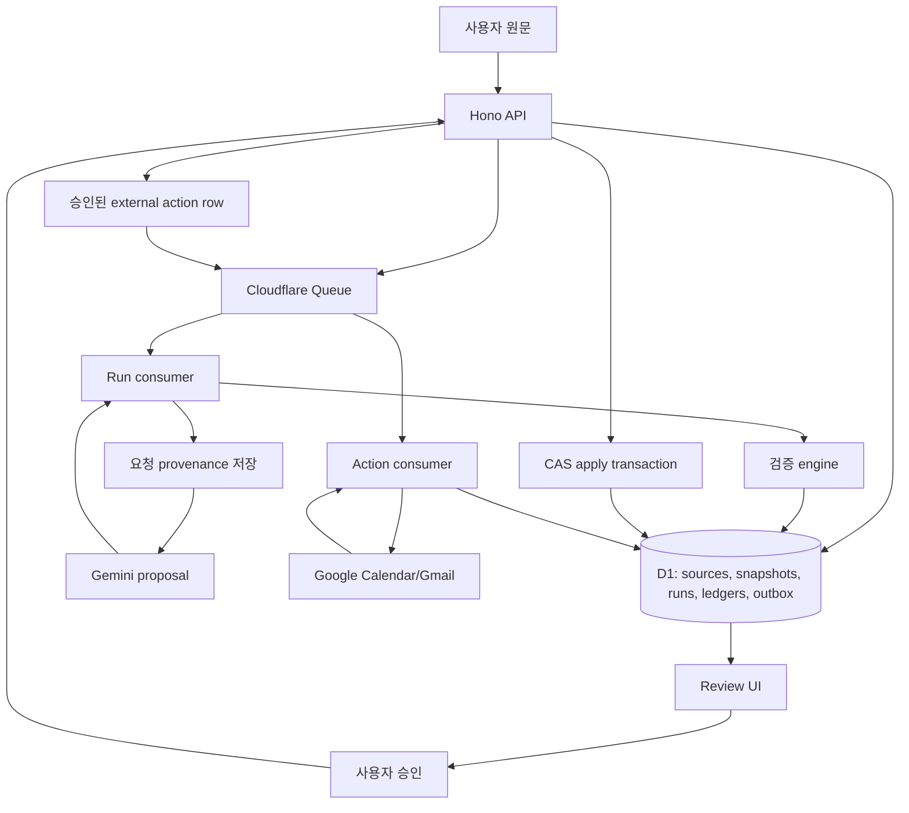

# 엔지니어링 케이스 스터디: 원문 근거를 추적하는 변경 처리 파이프라인

## 이력서용 요약

- TypeScript/Cloudflare 기반 파이프라인으로 변경 원문을 보존하고, AI 제안을 근거·숫자·날짜·버전 계약으로 검증한 뒤 승인된 변경만 D1 트랜잭션으로 적용했습니다.
- Queue 중복 전달, 오래된 버전의 요청, 모델 호출 예산, 외부 API의 불확실한 결과에 대응하는 상태 전이를 구현했습니다. 7일 미사용 보관과 Calendar 반영 후 재조회도 포함했습니다.
- 1인 프로젝트에서 Codex를 설계·구현에 활용하고, 독립 에이전트 리뷰와 회귀 테스트를 반복했습니다. 설계 판단과 검증 기준, 실패 및 수정 기록을 코드와 문서에 남겼습니다.

## 프로젝트 성격

이어짐은 변경된 안내문을 다루는 개인 작업 공간입니다. 사용자는 원문을 저장하고, 근거가 연결된 변경안을 검토한 뒤 충돌을 해결하고 승인합니다. 새 안내가 들어와도 직접 수정한 내용, 완료 기록, 고정한 결정과 원문 근거를 보존하는 것이 핵심 원칙입니다.

데이터 엔지니어링 관점에서 다음 문제를 다룹니다.

- 신뢰할 수 없는 외부 안내문을 수집한다.
- 원문 기록과 추출·계산한 상태를 분리한다.
- AI 출력을 스키마와 검증 함수로 확인한다.
- 비동기 실행, 멱등성, 비용 장부와 내용 이력을 관리한다.
- 외부 실행 요청은 outbox에 저장한다. Calendar는 반영 후 재조회하고, Gmail은 요청 접수 상태까지만 구분한다.
- 운영자가 처리 대기·결과 불확실·비용·저장 용량을 조사할 수 있도록 기록한다.

사용 기술은 React/Vite, Hono, Cloudflare Workers, D1, one Queue, Google OAuth/Calendar, Gemini generateContent입니다. Spark, Airflow, Kafka, dbt, Iceberg, Trino는 사용하지 않았습니다.

## 구조

## 근거 지도

- Source relation enum: [contracts.ts](../../src/core/contracts.ts#L15)
- Source 저장, hash, revision, pending run transaction: [db.ts](../../src/server/db.ts#L166)
- Queue consumer와 action/run 분기: [index.ts](../../src/server/index.ts#L17), [index.ts](../../src/server/index.ts#L31)
- 모델 요청 provenance를 fetch 전에 저장: [model.ts](../../src/server/model.ts#L85), [db.ts](../../src/server/db.ts#L629)
- Evidence 위치 검증과 계산: [engine.ts](../../src/core/engine.ts#L123), [engine.ts](../../src/core/engine.ts#L161), [engine.ts](../../src/core/engine.ts#L363)
- 승인 적용과 snapshot command transaction: [db.ts](../../src/server/db.ts#L292), [db.ts](../../src/server/db.ts#L754)
- Calendar outbox 승인, 처리, readback: [actions.ts](../../src/server/recovery/actions.ts#L120), [actions.ts](../../src/server/recovery/actions.ts#L186), [actions.ts](../../src/server/recovery/actions.ts#L390)
- Provider `sendUpdates=none`, `If-Match` update: [provider.ts](../../src/server/calendar/provider.ts#L124), [provider.ts](../../src/server/calendar/provider.ts#L134)
- Ops health snapshot: [ops-health.ts](../../src/server/ops-health.ts#L64)

테스트 근거:

- Queue 중복, dispatch 실패, stale apply, over-budget, expiry: [server.test.ts](../../tests/integration/server.test.ts#L592), [server.test.ts](../../tests/integration/server.test.ts#L1316), [server.test.ts](../../tests/integration/server.test.ts#L1397), [server.test.ts](../../tests/integration/server.test.ts#L922), [server.test.ts](../../tests/integration/server.test.ts#L1175)
- Run provenance와 uncertain handling: [run-provenance.test.ts](../../tests/integration/run-provenance.test.ts#L29), [run-provenance.test.ts](../../tests/integration/run-provenance.test.ts#L113), [run-provenance.test.ts](../../tests/integration/run-provenance.test.ts#L167)
- Calendar action unknown/stale/partial cancel: [recovery-actions.test.ts](../../tests/integration/recovery-actions.test.ts#L116), [recovery-actions.test.ts](../../tests/integration/recovery-actions.test.ts#L128), [recovery-actions.test.ts](../../tests/integration/recovery-actions.test.ts#L183)
- Calendar lifecycle race/adoption: [calendar-lifecycle.test.ts](../../tests/integration/calendar-lifecycle.test.ts#L104), [calendar-lifecycle.test.ts](../../tests/integration/calendar-lifecycle.test.ts#L122)
- Ops health: [ops-health.test.ts](../../tests/integration/ops-health.test.ts#L37), [ops-health.test.ts](../../tests/integration/ops-health.test.ts#L74)

## 구체 예시

기존 상태:

- 참석자 4명
- 공동 고정비 KRW 900,000
- 인당 비용 KRW 225,000
- 첫날 도착 10:00
- 둘째 날 19:00 저녁 약속은 사용자가 잠금
- 종이 확인서 출력 항목은 완료됨

새 안내:

> 참석자는 3명으로 변경됩니다. 첫날 도착은 오전 10시가 아니라 오후 4시입니다. 둘째 날 저녁 약속은 오후 8시로 변경해야 합니다. 종이 확인서 출력 항목은 삭제해 주세요.

처리 결과:

- 새 원문을 source revision으로 저장한다.
- Gemini가 proposal을 만들 수 있지만, 저장 전에 검증 코드가 source quote와 value를 확인한다.
- KRW 900,000 / 3 = 300,000 계산은 engine이 수행한다.
- 저녁 시간 변경은 locked item과 충돌로 표시한다.
- 완료된 삭제 요청은 source-vs-user 선택을 요구한다.
- 사용자가 resolution을 승인하면 exact base revision에만 적용된다.

구현된 검증 규칙을 묶어서 설명한 합성 예시입니다. 각 규칙의 테스트를 위에 연결했으며, 이 예시로 일반 자연어 입력의 정확도를 판단하지 않습니다.

## 파이프라인 설계

### 1. 원문 수집과 불변 근거

`WorkspaceStore.addSource`는 source ID, relation, target source, hash, source revision, raw text를 저장합니다. AI가 제안한 fact도 source quote와 start/end offset이 실제 저장 원문과 맞아야 합니다.

이 설계는 "이 값이 어느 문장에서 왔는가?"를 나중에 다시 검증할 수 있게 합니다. 대신 raw source text가 D1에 남으므로 입력 길이 제한, 7일 미사용 보관, 수동 삭제, export boundary가 필요합니다.

### 2. 모델 제안 경계

Gemini 호출은 JSON schema, `store:false`, low thinking, bounded output, 60초 timeout으로 제한됩니다. 요청 provenance는 fetch 전에 저장합니다. provenance 저장이 실패하면 provider call을 중단합니다.

모델은 후보를 제안할 수 있습니다. 검증 코드가 증명할 수 있는 것은 제한적입니다.

- quote가 실제 source span과 일치하는지
- 숫자가 quote와 일치하는지
- KRW/count/date_time 문법이 지원 범위 안인지
- update/delete 대상이 기존 state와 맞는지
- source/content revision이 proposal 기준과 같은지

검증 코드는 일반 의미 이해나 모델 정확도 전체를 보장하지 않습니다. 상대 날짜, 범위, 여러 시각, inherited timezone, 모호한 수량은 구조화하지 않거나 사용자 확인으로 남깁니다.

### 3. Queue와 run 안정성

Source 저장과 run 생성은 D1 transaction으로 묶입니다. Live model run은 dispatch 전에 admission budget을 reserve합니다. 이 reserve는 비용 관리용 ledger이며 provider invoice의 hard cap이 아닙니다.

Queue는 at-least-once입니다. 그래서 consumer는 모델 호출 전에 D1에서 pending run을 claim합니다. 같은 run ID가 두 번 와도 두 번째 delivery는 skip됩니다.

장애 처리:

- Queue send가 실패해도 pending row가 남아 scheduled recovery가 redispatch할 수 있습니다.
- running 상태가 오래 지속되면 uncertain으로 바뀝니다.
- provider timeout처럼 결과를 확정할 수 없는 paid call은 자동 retry하지 않습니다.
- usage metadata가 있으면 실패 output이어도 cost를 기록합니다.

이 설계는 exactly-once를 주장하지 않습니다. at-least-once delivery 위에 idempotent state transition을 얹은 구조입니다.

### 4. 승인과 원자 적용

Proposal에는 content revision, source revision, proposal revision이 포함됩니다. Apply는 pending proposal이 아직 같은 기준을 가리키고, 질문이 남아 있지 않고, conflict resolution이 유효할 때만 동작합니다.

적용 transaction은 snapshot insert, workspace revision 증가, pending clear, command replay record를 함께 처리합니다. 오래된 tab이나 늦게 도착한 model response가 최신 작업을 덮어쓰지 못하게 하는 CAS 구조입니다.

Restore도 과거 snapshot을 현재로 덮는 방식이 아니라 새 revision을 만듭니다. 인증, cost ledger, source catalog state, retention timestamp는 restore 대상이 아닙니다.

### 5. Calendar와 AX 경계

Calendar 실행은 model proposal의 부수효과가 아닙니다. 사용자가 recovery plan을 승인한 뒤 별도 external action row가 생기고, 같은 Queue가 `actionId`를 action consumer에 전달합니다.

Calendar action은 실행 전에 account ownership, connection version, scope, 현재 workspace/source/condition revision, origin freshness를 확인합니다. Provider write 전후에는 free/busy, 전용 calendar inventory, deterministic event ID, etag, readback payload match를 검사합니다.

실제 Calendar는 과거 승인 실행 1건에서 4개 합성 event를 검증한 근거가 있습니다. 최신 date-input checkpoint에서 전체 real-provider QA를 다시 실행한 것은 아닙니다. Email live send는 아직 검증하지 않았습니다.

## 운영 관찰

`collectOpsHealth`는 pending/running/uncertain run, budget policy violation, storage usage, reconciliation delta, daily admission count를 읽어 severity와 check code를 만듭니다. `npm run ops:local`은 local D1 상태를 확인합니다. 외부 alert delivery는 아직 연결되지 않았고, 기준은 [alert-readiness.md](../runbooks/alert-readiness.md)에 있습니다.

## 검증 근거와 한계

승인 checkpoint는 [PLANS.md](../../PLANS.md)에 기록되어 있습니다.

- `npm run verify` 통과: typecheck, lint, unit/integration, build
- 날짜 입력 focused 검증: unit 50개 + 실제 D1 integration 1개
- Chromium E2E: 111/111
- 2026-09-16 public Worker version: `938bbda4-c3b4-4b43-81a4-b60ad54995ab`

추가 문서:

- 날짜 입력 개선: [evidence-date-input-2026-09-16.md](../validation/evidence-date-input-2026-09-16.md)
- 엄격한 날짜 계약과 남은 extraction 실패: [notice-date-contract-2026-09-16.md](../design/notice-date-contract-2026-09-16.md)
- 합성 전략 비교: [finals-paired-2026-09-12.md](../evaluations/finals-paired-2026-09-12.md)
- 2026-09-16 사용성 배포 범위: [product-utility-2026-09-16.md](../operations/product-utility-2026-09-16.md)

위 수치는 2026-09-16 검증 기록입니다. README의 실행 명령은 [package.json](../../package.json)의 스크립트와 맞췄으며, GitHub의 새 환경에서 실행한 결과는 아래 Actions 기록으로 확인합니다.

첫 push 이후 재현 가능한 GitHub Actions 결과는 [verify workflow](https://github.com/masondev1024/ieojim/actions/workflows/verify.yml)에서 확인합니다.

## 면접에서 설명할 지점

- **왜 모델 출력을 바로 저장하지 않았나?** 운영 state는 source-linked여야 합니다. quote, 숫자, date/time, revision을 검증할 수 있는 범위만 저장해야 복구와 감사가 가능합니다.
- **왜 Queue와 D1 claim을 썼나?** 사용자 write를 paid provider call보다 먼저 durable하게 만들고, missed dispatch와 duplicate delivery를 state transition으로 흡수하기 위해서입니다.
- **uncertain paid call은 왜 자동 재시도하지 않나?** timeout은 provider 쪽 성공을 숨길 수 있습니다. 자동 retry는 중복 비용과 상충 proposal을 만들 수 있습니다.
- **왜 completed/locked/manual state를 보존하나?** source update가 human decision을 지우면 안 됩니다. 충돌과 stale review를 드러내는 편이 자동 overwrite보다 안전합니다.
- **다음 production-grade 작업은?** 실제 사람 대상 usefulness trial, 계정 전체 삭제와 장기 보관 정책, alert delivery, provider regression cadence, 비용 dashboard를 먼저 보강합니다.

## 남은 범위

- 실제 사용자 효용과 지불 의사는 아직 측정하지 않았습니다.
- 운영 환경에서 동시 Queue 처리·외부 API 시간 초과를 주입하는 시험과 여러 브라우저의 세션 해제 검증은 남아 있습니다.
- 자연어 날짜를 구조화하지 못한 실제 응답도 실패 기록으로 보존하고 있습니다. 앱은 근거를 보존하고 사용자가 직접 확인하도록 설계되어 있습니다.
- 장기 보관 정책, 계정 전체 삭제, 유료 요금제와 외부 알림 연결은 후속 과제입니다.
- `.omx/`와 `artifacts/`의 원본 실행 기록은 로컬에 보관하고, GitHub에는 검증 요약을 남깁니다.
