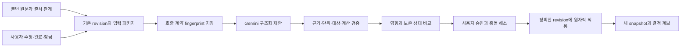

# 이어짐 — 2026 수상작 조사에 따른 엔지니어링 결정

기준일: 2026-09-09 KST. 공개 자료 조사와 현재 저장소 분석을 결합한 설계 판단이다. 대회별 수상 근거·기술 자료·미확인 항목은 [수상작 조사표](ai-competition-winners-2026.md), 실행 상태는 [PLANS.md](../../PLANS.md)에 기록한다. 이 문서는 완료되지 않은 기능을 구현 사실로 표현하지 않는다.

## 1. 추천 방향

이어짐의 중심을 **원문이 바뀌어도 사용자의 결정과 계산의 근거가 이어지는 작업 공간**으로 강화한다. 원문에서 구조를 만드는 AI와, 어떤 변경을 허용하고 적용할지 판단하는 코드를 분리한다. 사용자에게는 변경의 영향과 보존된 결정을 보여주고, 운영자에게는 실패 원인을 추적할 수 있는 실행 기록을 제공한다.

React·TypeScript·Hono·Workers·D1·Queue·Gemini는 이 방향을 구현하기에 적합한 현재 기반이다. 다른 수상작이 Python, Rust, .NET을 쓴다는 사실만으로 언어를 바꾸지 않는다. 이미지·GPU·생물정보학처럼 별도 생태계가 필요한 작업은 실제 요구가 생겼을 때 분리한다.

수상작에서 흔히 보이는 MCP, 근거 표시, 승인 UI, 다중 에이전트 자체를 독점적 차별점이라고 주장하지 않는다. 우리가 검증해야 할 가설은 **여러 차례 원문이 변경되는 상황에서 전체 재생성보다 불필요한 변경과 사용자 재작업이 적다**는 것이다. 아직 이 우위를 입증한 사용자 실험은 없다.

## 2. 조사 결과가 말하는 것과 말하지 않는 것

- 원티드 2026은 현재 접수 단계다. 자유 주제, 실제 문제 해결과 AI 활용, 배포된 서비스가 중요하며 아직 해당 회차 수상작은 없다. 참가 마감 9월 18일, 제출 마감 9월 20일, TOP20 발표 10월 7일, 데모데이 10월 17일은 확인 당시 일정이다. [원티드 공식 안내](https://static.wanted.co.kr/ai-championship/2026/landing.html)
- 2026 Claude Build Day 1위 Tekton은 구성 요소를 역사 자료에 연결하고 검증하는 경험을 보여준다. 공개 저장소는 TypeScript/React 기반의 정적 데이터와 검증 단계를 설명하며, 런타임 LLM 호출과 개발 중 AI 사용을 구분한다. [공식 수상 발표](https://claude.com/blog/meet-the-winners-of-our-claude-opus-4-8-build-day-hackathon), [Tekton 저장소](https://github.com/tangxiya-star/Tekton)
- Engagement Hub는 승인, 업무 맥락에 따른 중복 방지, correlation ID가 있는 기록을 설명한다. 이런 설계는 AI 출력을 실제 업무 상태로 전환할 때 필요한 경계다. 해당 저장소를 읽은 것이 배포 환경의 동시성 안전성을 직접 재현했다는 뜻은 아니다. [프로젝트 저장소](https://github.com/leila-marspooner/engagement-hub-agent)
- AquaLens는 Gemini가 작성하는 설명과 결정론적 위험 점수를 구분한다. 우리도 비용 계산과 보호 상태를 모델의 자유 텍스트 판단에 맡기지 않는다. AquaLens의 지도·위성 분석용 PostGIS/pgvector 구성은 그 제품의 요구에 맞는 것으로, 이어짐에 그대로 필요한 구성은 아니다. [AquaLens 저장소](https://github.com/talhaabidj/aqualens)
- SANS Find Evil 2026 상위 다섯 작품은 증거 검증과 제한된 도구, 반박 절차를 보여준다. 보안 대회의 판단 기준을 원티드의 공식 배점으로 바꾸어 해석하지 않는다. [SANS 수상 발표](https://www.sans.org/press/announcements/sans-names-the-five-winners-of-find-evil-2026)

표본은 공개 기술 자료가 있는 작품에 치우친다. 특정 공급사의 대회는 해당 공급사의 도구 사용을 장려하므로 기술 점유율 표본이 아니다. 수상작 저장소의 현재 코드가 수상 당시 제출 커밋과 같다는 보장도 없다. 발표된 성능 수치는 별도 재현 전까지 제작자 또는 주최 측의 보고로 취급한다.

## 3. 실리콘밸리의 실무와 연결되는 채택 기준

### 평가를 먼저 정의하고 변경을 비교한다

Anthropic의 2026년 1월 평가 글은 과제·시도·판정기를 구분하고, 코드 판정과 모델 판정, 사람 평가를 용도에 따라 조합한다. 우리에게는 숫자·ID·권한·보호 상태를 코드로 검사하고, 이해하기 쉬운 설명과 검토 부담을 사람에게 평가받는 분담이 적합하다. 모델 판정 하나로 전체 정확도를 확정하지 않는다. [Anthropic: Demystifying evals](https://www.anthropic.com/engineering/demystifying-evals-for-ai-agents)

### 컨텍스트를 관리되는 입력 데이터로 취급한다

Anthropic의 컨텍스트 엔지니어링은 제한된 입력 안에서 관련 정보의 품질을 높이는 문제다. 이를 이어짐에 적용할 때에는 최신 원문만 남기고 이전 근거를 버리는 요약을 피해야 한다. 정정 대상, 현재 사실의 출처, 사용자의 수정·완료·잠금과 계산 의존성을 함께 선택해야 한다. [Anthropic: Effective context engineering](https://www.anthropic.com/engineering/effective-context-engineering-for-ai-agents)

### 하네스는 검사 가능한 경계를 제공한다

OpenAI의 2026년 하네스 사례는 저장소 안의 탐색 가능한 문서, 격리된 실행 환경, 에이전트가 읽을 수 있는 관측 자료와 자동 검사를 강조한다. 현재 짧은 AGENTS.md, PLANS.md, 격리 E2E, 운영 SQL을 유지하고 실제 실패에서 필요한 검사만 추가한다. 그 사례의 자동 병합 정책은 사용자의 Git 승인 경계를 바꾸는 근거가 아니다. [OpenAI: Harness engineering](https://openai.com/index/harness-engineering/)

### 구조화된 출력 뒤에도 의미 검증이 필요하다

Gemini의 JSON Schema 지원을 활용하되 로컬 Zod 검증을 유지한다. 문법상 올바른 숫자도 통화·단위·대상·시점이 틀릴 수 있다. `300000`이라는 JSON 숫자의 형식과, 이 값이 정확히 3명의 분담금이라는 주장은 서로 다른 계약이다. [Gemini structured output](https://ai.google.dev/gemini-api/docs/structured-output)

### 복구는 비즈니스 부작용의 경계에 맞춘다

Cloudflare Queue의 전달은 at-least-once다. 작업 ID로 한 번만 점유하고, 결과가 불확실한 유료 호출은 자동 반복하지 않는 현재 정책이 필요하다. Workflows를 도입하더라도 각 단계의 멱등성·재시도 조건은 별도로 설계해야 한다. [Queues delivery guarantees](https://developers.cloudflare.com/queues/reference/delivery-guarantees/), [Workflows rules](https://developers.cloudflare.com/workflows/build/rules-of-workflows/)

이러한 관행 중 멱등성, 계보, 데이터 계약은 오래된 엔지니어링 원칙이다. 새로운 점은 비결정적인 모델 출력을 그 경계 안에서 운영하고 평가하는 적용 방식이다. 모든 실리콘밸리 기업이 하나의 기술 스택을 채택했다는 주장은 하지 않는다.

### 2026년에 검토할 연구·표준화 기술

| 기술 | 근거와 성숙도 | 이어짐의 채택 판단 |
| --- | --- | --- |
| GEPA — 실행 피드백을 이용한 프롬프트 최적화 | 2025년 최초 공개, 2026년 2월 개정, ICLR 2026 Oral. 후보 prompt를 반성·변이·평가하는 연구이며 특정 benchmark 성능을 이어짐의 개선치로 환산할 수 없다. [논문](https://arxiv.org/abs/2507.19457), [공식 코드](https://github.com/gepa-ai/gepa) | 향후 오프라인 최적화 후보. 먼저 개발/검증/최종 미사용 평가 자료와 호출 예산을 분리한다. 한 번도 튜닝에 사용하지 않은 자료에서 개선이 유지될 때만 후보 prompt hash를 승격한다. 현재 Python optimizer나 자동 prompt 수정 루프는 설치하지 않는다. |
| RLM — 긴 입력을 외부 환경으로 두고 부분 탐색·재귀 호출 | 2025년 12월 공개, 2026년 5월 개정. 긴 컨텍스트 과제에 대한 추론 방식 연구다. [논문](https://arxiv.org/abs/2512.24601), [저자 코드](https://github.com/alexzhang13/rlm) | 근거를 필요한 만큼 읽는 설계 아이디어는 참고한다. 현재 계획은 결정론적 TS 입력 선택이며 RLM 구현이라고 부르지 않는다. 사용자 원문에서 임의 REPL 코드나 재귀 에이전트를 실행할 이유는 현재 없다. |
| OpenTelemetry GenAI semantic conventions | 모델/에이전트 실행의 공통 관측 어휘. 전용 upstream 저장소로 옮겨졌으며 development 규약은 고정된 장기 계약으로 가정하지 않는다. [공식 안내](https://opentelemetry.io/docs/specs/semconv/gen-ai/), [upstream](https://github.com/open-telemetry/semantic-conventions-genai) | model·operation·usage·latency·error class를 연결하는 운영 설계에 반영한다. 별도 exporter 도입 시 버전을 고정하고 로그 쿼리 호환을 검사한다. 이번 provenance metadata 추가를 OTel exporter 구축 완료로 표현하지 않는다. |

최신 연구를 아는 것과 서비스에 즉시 도입하는 것은 다른 판단이다. 이 후보들은 신뢰성·품질·비용 지표를 개선하는 증거가 있을 때 확대한다.

## 4. 현재 코드와 실제 간극

| 영역 | 이미 구현된 기반 | 다음에 해결할 간극 |
| --- | --- | --- |
| 데이터 계약 | 네 종류 블록, Zod 출력 계약, 정확한 원문 인용, 수치 일관성 검사 | 숫자·통화·인원·날짜의 명시적 의미형과 정규화 규칙 |
| 변경 보존 | 안정적 ID, 수동 수정·완료·잠금 보존, 충돌 해소, 정확한 revision 적용 | 새 키를 만들어 기존 대상을 우회하는 경우까지 다루는 명시적 대상 작업 |
| 데이터 흐름 | immutable source → proposal → 승인 → atomic snapshot revision | 실행 계약의 fingerprint와 사용자에게 보이는 영향·계보 연결 |
| 모델 입력 | 전체 입력 한도와 호출 전 비용 예약 | 관련 데이터만 선택하는 결정론적 입력 패키지와 품질 비교 |
| 평가 | deterministic tests, 기존 4개 고정 사례, 새 17개 challenge와 실패 판정 | 새 사례 실제 모델 실행, 반복 시도 안정성, 튜닝에 사용하지 않은 최종 검증 자료 |
| 운영 | D1 claim/CAS, 보수적 비용 원장, 복구 cron, safe telemetry | 실제 Queue·cron 장애 및 rollback 증거, 운영자 알림 수신 경로 |
| 제품 UX | 근거, 변경 제안, 충돌, 복원, 실패 시 초안 유지 | 영향 범위와 보존된 상태를 한눈에 파악하는 비교 화면, 사용자 검토 시간 측정 |

직접 코드 근거: [출력·공유 계약](../../src/core/contracts.ts), [결정론적 엔진](../../src/core/engine.ts), [제안 안전성](../../src/core/proposal-safety.ts), [모델 어댑터](../../src/server/model.ts), [DB 상태 전이](../../src/server/db.ts), [Queue/cron](../../src/server/index.ts), [평가 판정](../../src/evaluation/eval-quality.ts).

## 5. 목표 데이터 흐름

이 그림은 목표 구조다. 명시적 의미형·입력 축소·통합 영향 화면은 아래 후속 단계에 속한다. 원문·관측 사실·AI 후보·사용자가 승인한 현재 값을 구분하는 것이 핵심이며, 별도의 데이터 레이크를 구축한다는 의미는 아니다.

## 6. 실행 우선순위와 종료 조건

| 순서 | 구체적 변화 | 관찰 가능한 완료 조건 | 주요 비용·위험 |
| --- | --- | --- | --- |
| U1 | 실행별 요청/프롬프트/스키마 fingerprint, 고정 challenge 계약 | 실제 전송 body와 해시 일치; 저장 실패 시 fetch 0회; legacy는 null; 질문과 잘못된 변경이 함께 있으면 평가 실패 | 호출 전 D1 쓰기 1회 추가; 기록 저장소 장애 때 가용성 감소 |
| U2 | 최소 의미형 + 명시적 기존 대상 수정/삭제 | KRW·인원·날짜/시각의 허용 범위 명확화; 같은 대상 우회 ID 거절; 모호한 단위와 시점은 질문; 보호 상태 손실 0 | 계약 진화·기존 데이터 호환; 의미를 추측해 일괄 backfill하지 않음 |
| U3 | 변경 영향과 보존 상태 비교 UX | 수정되는 값/연관 항목/유지되는 잠금/근거를 한 흐름에서 확인; 시나리오를 모르는 사용자도 적용 결과를 설명 | 화면 복잡도, 접근성, 기존 초안/비동기 응답 경합 회귀 |
| U4 | full/compact 입력 패키지 비교 | 동일 base·sources·model·계약 기준 비교; 보호 손실·출처 권한 오류 0; 사전 정의 품질 기준 충족 후 입력 bytes/tokens 개선 확인 | 필요한 근거 누락; paired 평가 비용 증가; 공급사 cache hit에 의존하지 않음 |
| U5 | 원격 운영 승인 조건 마무리 | 실제 중복 Queue 전달에도 유료 호출 중복 0; 실제 cron 복구/expiry; rollback 후 데이터 유지; 알림 수신 확인 또는 미완료 명시 | 외부 권한·알림 수신자·플랫폼 비용과 시간 |
| U6 | 사용자 실험과 대회 증거 | 새 입력에서 전체 재생성과 비교; 검토 시간·불필요 변경·실패·비용·지연을 모두 보고 | 작은 표본, 학습 효과, 튜닝 데이터 누출 |

U5의 원격 운영 검증은 이미 배포한 staging에서 U2–U4와 병행할 수 있으며, production 공개의 선행 조건이다. UI나 모델 최적화를 이유로 운영 검증을 면제하지 않는다. U1을 첫 번째 작은 구현으로 시작하고, 모델 품질이 불충분하면 컨텍스트 최적화보다 U2와 평가를 우선한다.

### U1의 실패·복구·데이터 보존 계약

- 실제 보낼 body를 한 번 직렬화하여 그 bytes를 해시하고 같은 body를 전송한다. API 키는 HTTP header이므로 fingerprint 입력과 저장 내용에 포함하지 않는다.
- 현재 running인 live 실행의 owner/workspace/base revision이 일치할 때만 metadata를 한 번 기록한다. 기록 실패는 모델 호출 전 실패로 처리한다.
- fingerprint가 있다고 외부 호출 성공이 입증되는 것은 아니다. 저장 직후 프로세스가 종료될 수 있다. 호출 이후 불확실한 결과에는 기존 보수적 재호출 정책을 적용한다.
- fingerprint만으로 모델 응답이 재현되지는 않는다. 모델은 비결정적이고 동일 모델 ID의 제공 내용도 바뀔 수 있다. 이 기능의 약속은 입력과 계약 비교 및 원인 분류다.
- metadata는 private run에만 둔다. 원문은 기존 소스 저장소에 보관하되 로그·telemetry에 복제하지 않는다. hash도 상관관계를 만들 수 있으므로 공개 분석 자료로 취급하지 않는다.
- 기존 실행과 fixture에는 거짓 fingerprint를 backfill하지 않는다. workspace 삭제/만료는 run metadata도 삭제하고, 복원은 content revision만 만든다. 외부 비용 원장은 기존 정책을 따른다.

### U2의 데이터 엔지니어링 계약

우선 money/count/date/time 정도의 작은 의미형으로 제한한다. 원문 표현과 정규화 값, 단위, 출처를 함께 다룬다. 날짜에 연도나 시간대가 없으면 시스템 시간으로 조용히 채우지 않는다. 의존 관계는 현재 `factKeys`와 계산 참조에서 얻고, 비용 재계산과 stale 판정을 결정론적으로 만든다.

도착 순서와 사실의 권한은 다르다. 늦게 들어온 오래된 안내가 최신 확정 내용을 덮어쓰면 안 된다. 현재 addition/correction/replacement와 targetSourceId 규칙을 유지하며, 실제 유효 시점이 필요한 요구가 생기면 관측 시점과 분리한다. 지금 없는 event-time을 만들어 bitemporal이라고 부르지 않는다.

핵심 실험: 총액 900,000원은 그대로 두고 인원이 4명에서 3명으로 변경되면 분담금만 225,000원에서 300,000원으로 바뀐다. 일정과 비용의 관련 항목을 찾되, 잠긴 저녁 일정과 수동 메모는 보존하거나 명시적 검토 대상으로 남긴다.

### U4의 실험 계약

입력 축소는 모델이 읽는 작업 상태의 물질화된 뷰를 만드는 문제로 다룬다. 처음부터 vector DB나 GraphRAG를 도입하지 않는다. 관련 사실과 파생 항목, 출처 관계와 보호 상태의 transitive dependency를 빠뜨리지 않는 선택 규칙이 먼저다. 동일 입력의 패키지 fingerprint가 같아야 한다.

한 번의 성공으로 기본값을 바꾸지 않는다. 개발용 회귀 자료와 최종 미사용 평가 자료를 분리하고, 축소율뿐 아니라 잘못된 질문·누락된 영향·불필요한 변경을 측정한다. 새로운 live 결과가 나오기 전에 corpus와 판정기를 고정한다.

## 7. 지금 추가하지 않을 구성과 도입 조건

| 후보 | 현재 판단 | 다시 검토할 조건 |
| --- | --- | --- |
| LangGraph/CrewAI/ADK 기반 다중 에이전트 runtime | 현재 단일 제안에 추가하지 않음 | 독립 하위 작업이 있고 single-model 대비 품질 이득이 반복 평가로 확인될 때 |
| Cloudflare Workflows/Temporal | Queue + D1 상태 전이 유지 | 여러 외부 부작용·장시간 대기·단계별 복구가 현재 구조를 실제로 복잡하게 만들 때 |
| Vector DB/GraphRAG | exact source/ID 관계 우선 | 소스 규모가 커져 결정론적 선택의 recall/비용 한계를 측정했을 때 |
| Runtime MCP/A2A/MCP Apps | 개발용 MCP와 제품 통합을 구분 | 승인된 외부 읽기/쓰기 사용례, 인증 주체, 범위, 멱등성, 감사 정책을 먼저 정의했을 때 |
| Kubernetes/Kafka/Spark/Iceberg/Airflow | 현재 서비스에 추가하지 않음 | 다수의 대용량 데이터 제품, backfill, 분산 처리와 운영 인력이 실제로 필요할 때 |
| 자율 prompt 수정·모델 fallback·무한 reviewer loop | 기본 서비스에 추가하지 않음 | 독립 평가·비용 한도·변경 승인·rollback이 있는 오프라인 실험으로 입증될 때 |
| 모델 생성 코드 실행/sandbox | 현재 네 블록 제품 범위에서 제외 | 사용자가 실행형 산출물을 요구하고 별도 격리·권한 계약을 승인했을 때 |

대회 수상이나 실험용 benchmark만으로 production 신뢰성을 인정하지 않는다. 먼저 유지보수자가 이해하고 장애 때 복구할 수 있는 크기로 설계를 유지한다.

## 8. 대회에서 보여줄 증거

추천 시연은 새 원문 하나로 시작해 생성 → 사용자 수정/완료/잠금 → 서로 충돌하는 추가 자료 → 영향 비교 → 충돌 선택 → 적용 → 새로고침 → 복원의 흐름이다. 질문이 필요한 모호한 자료도 한 번 넣어, 확실하지 않을 때 멈추는 행동을 보여준다.

평가표에는 정확도만 두지 않는다. 보호 상태 손실률, 불필요 변경 수, 올바른 충돌/질문, 계산 정확성, 검토 소요 시간, p50/p95 지연, 성공한 작업당 비용, 불확실한 호출 수를 함께 둔다. 시도 수가 적으면 p95나 우월성 해석에 한계를 표시한다. 공급사가 제공한 학습비나 모델 수를 사용 가치의 대용으로 쓰지 않는다.

하루 6시간 기준으로 남은 제출 기간의 우선순위는 핵심 변경 정확성·이해 가능한 비교 화면·새 입력 실험이다. 각 단계의 실제 소요를 기록해 다음 단계 범위를 조정하고, 제출 직전에는 계약·모델을 크게 바꾸는 작업보다 회귀 검사와 장애 증거, 설명 가능한 시연을 우선한다.

## 9. 조사 후 구현 증거

U1의 첫 구현은 로컬에서 완료했다. 요청·instruction·로컬 schema·generation config·모델 가격 정책의 fingerprint와 크기를 private run에 기록하며, 저장 실패/기준 revision 불일치/만료는 유료 fetch를 차단한다. 0006은 nullable 4096-byte JSON 컬럼이며 legacy/fixture에 거짓 데이터를 채우지 않는다. 실제 D1 abort, 기존 DB의 0001–0005 → 0006 업그레이드, 복원 시 유지, 삭제 cascade를 검증했다.

루트 최종 `npm run verify`: 단위 104개 + 통합 81개, 타입·lint·build 통과. 브라우저 21개 통과. 독립 검토 범위에서 남은 실질적 코드 문제 0건. 정상 로컬 DB 업그레이드 전후 1개 공간·3개 소스·4개 snapshot·3개 run·3개 원장 행이 유지됐고 기존 provenance는 null이다. 새 17개 challenge는 corpus hash를 고정한 dry-run까지 완료했으며 새 유료 평가를 실행한 것은 아니다.

기존 staging에서는 실제 scheduled invocation과 `cron_recovery=completed`, `ops_health.severity=ok`를 2026-09-09 13:45 KST에 관측했다. 당시 pending 작업과 만료 작업은 0개이므로 장애 복구나 expiry 성공을 실증한 것은 아니다. 새로운 0006/코드는 staging에 적용하지 않았으며, 원격 Gemini 호출·중복 전달·fault/rollback·알림 수신은 남아 있다. 목표 설계 전체와 public production 완료는 별개다.
